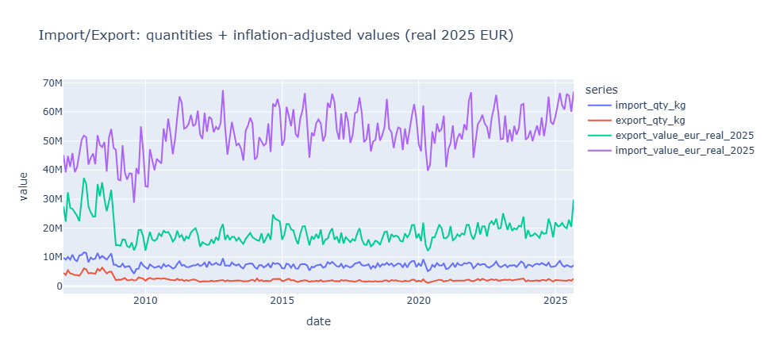
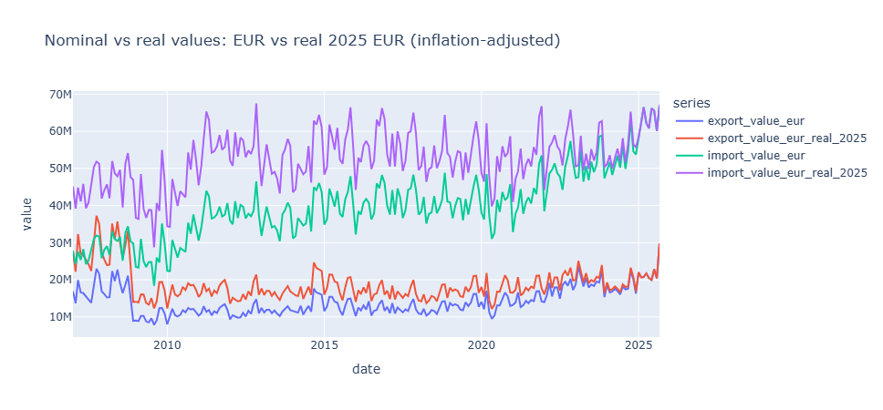

# Capstone Project - Team Fitzgerald

Team-members: *Andreas Ranzmaier & Lea Treml*

## Initial Thoughts

After searching for a suitable dataset that allows us to analyze past trends and predict future developments, we decided to work with the Austrian Import and Export dataset. To make the analysis more focused and interesting, we narrowed the scope down to **Section 9 – Coffee, Tea, Mate, and Spices**, instead of looking at total imports and exports.

The dataset currently covers the period from **2007 onward** and is published at a **monthly frequency**, which makes it well suited for time series forecasting.

Ideally, since our task is to generate forecasts starting from **January 1st, 2026**, we would like to have complete data up to **December 2025**. However, at the moment, the most recent available data only goes up to **September 2025**. According to the publication schedule, preliminary data for **October 2025** will be released on **January 9th, 2026**, which will at least allow us to partially validate our forecasts once it becomes available. Because of this timing issue, we need to slightly bend the rules regarding data availability.

The core question we want to answer is whether observed increases in import values are driven by **higher quantities being imported**, or whether they are mainly caused by **rising prices** (so yeah, are we actually buying more, or is it just getting more expensive).

## Preprocessing

The data was downloaded via the **StatsCube link** provided on the official Statistics Austria website for international trade data [https://www.statistik.at/statistiken/internationaler-handel/internationaler-warenhandel/importe-und-exporte-von-guetern].

Between downloading the raw `.csv` file and using it for preprocessing, some manual adjustments were necessary. Everything except the actual data and column names was removed. This included external metadata, empty columns, and empty rows. In addition, the monthly entries had to be reordered correctly, since this was not directly possible within StatsCube itself (at least to our knowledge).

For comparison purposes, we extracted **both quantity (kg)** and **value (EUR)** data for imports and exports from StatsCube.

All further preprocessing and cleaning steps were done in **Python**.

---

### Cleaning the Data

The first step was renaming the original **German column names** to English for better readability. The time column was renamed to `period`, and all quantity-related columns were shortened to `qty` in their names.

Next, the `period` column had to be converted into a proper date format. Originally, it was stored as a string containing abbreviated month names and two-digit years (e.g. `Feb.25`).
To fix this:

* Any unnecessary characters (such as dots or extra spaces) were removed.
* The month abbreviation was extracted and mapped to its corresponding numeric value (e.g. `Feb` → `02`).
* The two-digit year was extracted and expanded to a four-digit year.
* Finally, these components were combined into a standard date format (`YYYY-MM-01`) and converted into a proper date column.
* The original `period` column was dropped afterward.

This resulted in a clean and consistent monthly date column that could be used directly for time series analysis.

---

### Inflation Adjustment

After cleaning the raw data, we decided to additionally investigate whether changes in import and export values were influenced by **inflation effects**.

To do this, the Euro-based values were adjusted using official Austrian inflation data
(source: WKO inflation overview [https://www.wko.at/statistik/prognose/inflation.pdf]).

The inflation adjustment was applied cumulatively, meaning that each year includes the inflation effects of all previous years. This allows for a more meaningful comparison of monetary values over time and helps distinguish between real growth and price-level effects.

### Autocorrelation

### Seasonality - Time series diagnostics

### Visualisation

The following figures illustrate the development of import and export quantities as well as inflation-adjusted values over time.

To avoid misinterpretation, it is important to clarify that **“Real 2025 EUR”** refers to the **price level** in which all values are expressed, not the time period used to calculate inflation.

To obtain inflation-adjusted values, we constructed a **CPI-like index** by compounding the officially published annual inflation rates for the years **2007–2025**. Using this index, each nominal value was rescaled according to:

***Real Value_2025 = Nominal Value_year × (CPI_2025 / CPI_year)***

This means that a value originally observed in, for example, **2007** is adjusted to reflect the same purchasing power as in **2025**. Consequently, all inflation-adjusted monetary values are directly comparable across time and are expressed in **2025 euros**, which explains why the corresponding columns are suffixed with `_real_2025`.

### Preprocessing thoughts

Joa 

## Predictions

### Baseline

### Statistical

### Maschine Learning

### Neural

## Analysis

## Closing Thoughts

## Useful Links
 https://www.statistik.at/fileadmin/shared/QM/Standarddokumentationen/U/std_u_itgs.pdf
