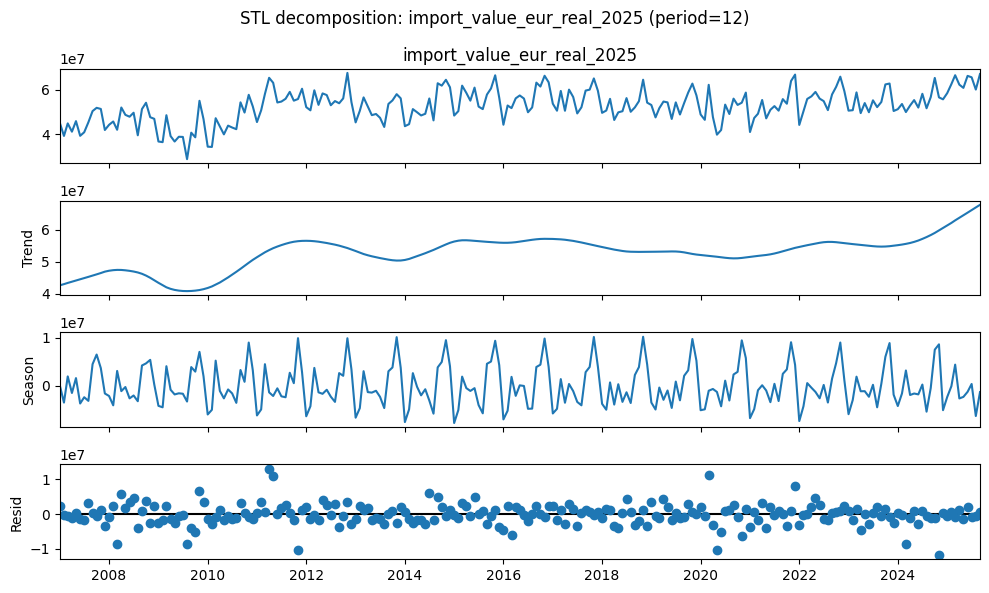
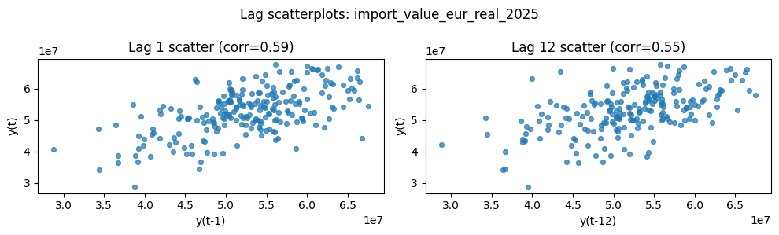
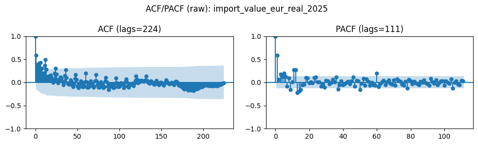
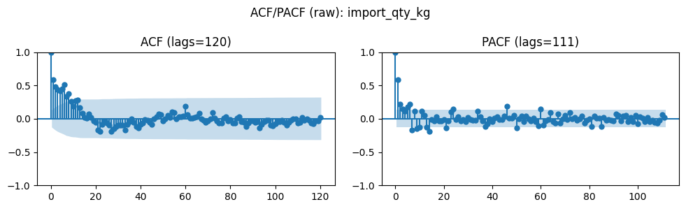
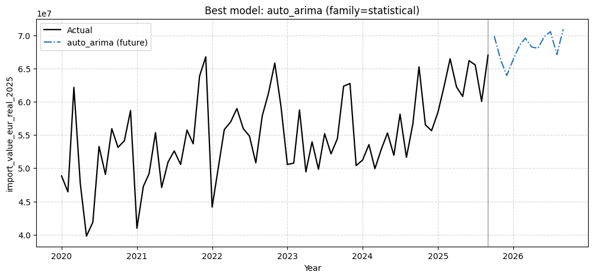
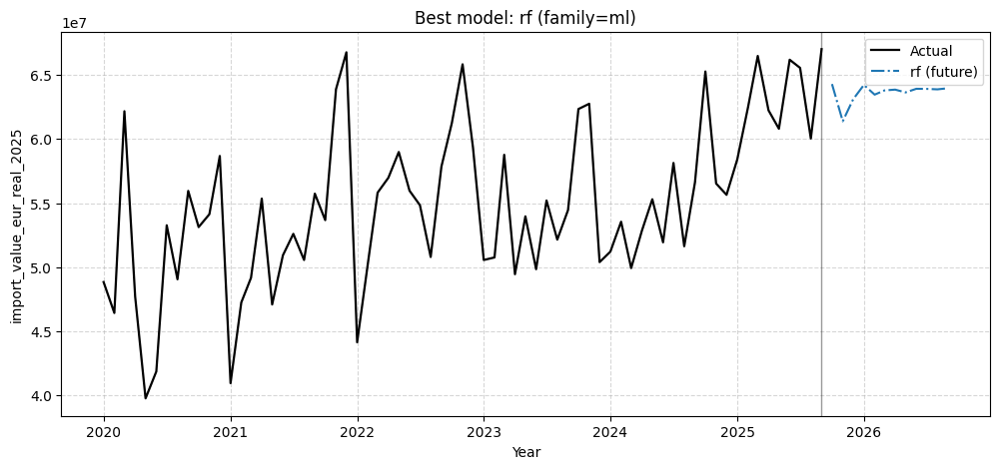
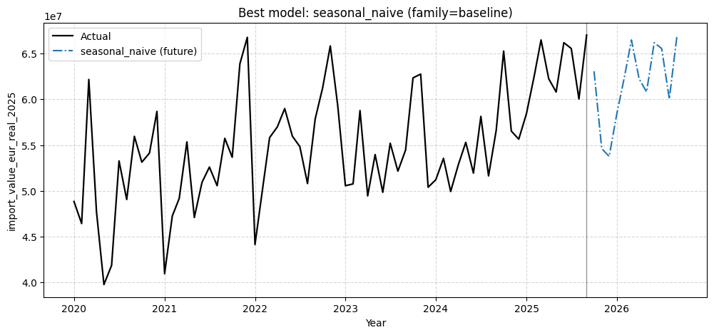

# Capstone Project - Team Fitzgerald

Team-members: *Andreas Ranzmaier & Lea Treml*

## Initial Thoughts

After searching for a suitable dataset that allows us to analyze past trends and predict future developments, we decided to work with the Austrian Import and Export dataset. To make the analysis more focused and interesting, we narrowed the scope down to **Section 9 – Coffee, Tea, Mate, and Spices**, instead of looking at total imports and exports.

The dataset currently covers the period from **2007 onward** and is published at a **monthly frequency**, which makes it well suited for time series forecasting.

Ideally, since our task is to generate forecasts starting from **January 1st, 2026**, we would like to have complete data up to **December 2025**. However, at the moment, the most recent available data only goes up to **September 2025**. According to the publication schedule, preliminary data for **October 2025** will be released on **January 9th, 2026**, which will at least allow us to partially validate our forecasts once it becomes available. Because of this timing issue, we need to slightly bend the rules regarding data availability - but of course we also predicted the data for **January 2026**.

The core question we want to answer is whether observed increases in import values are driven by **higher quantities being imported**, or whether they are mainly caused by **rising prices** — so are we actually buying more, or is it just getting more expensive.

## Preprocessing

The data was downloaded via the **StatsCube link** provided on the official Statistics Austria website for international trade data:
[[https://www.statistik.at/statistiken/internationaler-handel/internationaler-warenhandel/importe-und-exporte-von-guetern](https://www.statistik.at/statistiken/internationaler-handel/internationaler-warenhandel/importe-und-exporte-von-guetern)]

Between downloading the raw `.csv` file and using it for preprocessing, some manual adjustments were necessary. Everything except the actual data and column names was removed. This included external metadata, empty columns, and empty rows. In addition, the monthly entries had to be reordered correctly, since this was not directly possible within StatsCube itself (at least to our knowledge).

For comparison purposes, we extracted **both quantity (kg)** and **value (EUR)** data for imports and exports from StatsCube.

All further preprocessing and cleaning steps were done in **Python**.

### Cleaning the Data

The first step was renaming the original **German column names** to English for better readability. The time column was renamed to `period`, and all quantity-related columns were shortened to `qty` in their names.

Next, the `period` column had to be converted into a proper date format. Originally, it was stored as a string containing abbreviated month names and two-digit years (e.g. `Feb.25`). To fix this:

* Unnecessary characters (such as dots or extra spaces) were removed.
* The month abbreviation was extracted and mapped to its corresponding numeric value (e.g. `Feb` → `02`).
* The two-digit year was extracted and expanded to a four-digit year.
* These components were combined into a standard date format (`YYYY-MM-01`) and converted into a proper date column.
* The original `period` column was dropped afterward.

This resulted in a clean and consistent monthly date column that could be used directly for time series analysis.

### Inflation Adjustment

After cleaning the raw data, we decided to additionally investigate whether changes in import and export values were influenced by **inflation effects**.

To do this, the Euro-based values were adjusted using official Austrian inflation data
(source: WKO inflation overview:
[[https://www.wko.at/statistik/prognose/inflation.pdf](https://www.wko.at/statistik/prognose/inflation.pdf)]).

The inflation adjustment was applied cumulatively, meaning that each year includes the inflation effects of all previous years. This allows for a more meaningful comparison of monetary values over time and helps differentiate between real growth and pure pricing effects.

## Seasonality and Time Series Diagnostics

Before fitting statistical forecasting models, we performed a set of **time series diagnostics** to better understand the structural properties of the data — in particular **seasonality, trend behavior, and stationarity**. This step is important because many statistical models (such as ARIMA) rely on assumptions about stationarity and seasonal structure.

### Time Series Construction

The selected variable was converted into a clean monthly time series by:

* keeping only the date and value columns
* converting the date column into a proper datetime format
* sorting the data chronologically
* and setting the date as the time index

For the diagnostics, we used **import quantities in kilograms (`import_qty_kg`)** as the default series, since it represents real *physical* demand and is not directly affected by inflation.

### Stationarity Tests

To assess stationarity, we applied two complementary statistical tests:

* **Augmented Dickey–Fuller (ADF) test**
  *Null hypothesis (H₀):* The series has a unit root (is non-stationary).

* **KPSS test**
  *Null hypothesis (H₀):* The series is stationary around a constant level.

| Series                    | Test | H₀                         | Stat      | p-value  | Lags | nobs | Crit 1%   | Crit 5%   | Crit 10%  |
|---------------------------|------|----------------------------|-----------|----------|------|------|-----------|-----------|-----------|
| import_value_eur_real_2025 | ADF  | unit root (non-stationary) | -2.175337 | 0.215318 | 14   | 210  | -3.461879 | -2.875404 | -2.574159 |
| import_value_eur_real_2025 | KPSS | stationary (level)         | 1.106780  | 0.010000 | 8    | 225  | 0.739000  | 0.463000  | 0.347000  |

This combination of results indicates that the series is **not a pure random walk**, but also **not strictly level-stationary**.

Such a pattern usually occurs when a time series is either:

* **trend-stationary** (stationary around a deterministic trend), or
* affected by **structural breaks** or gradual level shifts over time.

### Seasonal–Trend Decomposition (STL)

To further investigate the structure of the series, we applied **STL decomposition** with a monthly period (12) and robust fitting.

The decomposition separates the series into:

* **Trend component**
  Shows slow-moving changes in the average level over time.

* **Seasonal component**
  Reveals a stable and recurring annual pattern, indicating strong monthly seasonality.

* **Remainder (residuals)**
  Contains short-term fluctuations and noise after removing trend and seasonality.

Shows that the trend is going up in the recent years.
It looks to be quite seasonal.

### Interpretation and Implications for Modeling

The diagnostics suggest that:

* The series exhibits **clear annual seasonality**
* There is **no evidence of a stochastic unit root**, but the mean is not constant
* The data is likely **trend-stationary with seasonality**, rather than difference-stationary

This justifies:

* the use of **seasonal baseline models** (e.g. seasonal naive),
* and **ARIMA-based models** with seasonal components and limited differencing

These findings informed our model selection and parameter choices in the forecasting stage.

### Autocorrelation

Autocorrelation measures how much a time series is correlated with itself at different lags (*k*). This helps identify patterns such as persistence, seasonality, and the memory of the series, which is essential for choosing appropriate forecasting models.

The scatter plot shows that **lag 1** has a slightly higher correlation (≈ 0.59) compared to **lag 12** (≈ 0.55). This indicates that the series has **short-term persistence** (values tend to be similar to the previous month) and some **yearly seasonality** (lag 12 represents 12 months).

The **ACF (Autocorrelation Function)** and **PACF (Partial Autocorrelation Function)** plots further illustrate these relationships:

* **ACF:** Shows correlations at multiple lags. The gradual decay and peaks at seasonal lags (12, 24…) suggest **seasonal patterns** and some **trend components**.
* **PACF:** Highlights the correlation at a given lag after removing the influence of intervening lags. Significant spikes at lag 1 and smaller spikes at seasonal lags indicate that **recent months influence the current month more strongly**, while seasonal effects are also present but weaker.

The **high variance in these plots** can arise due to:

1. **Noise in monthly imports** – short-term fluctuations in import quantities cause variability.
2. **Structural breaks or irregular events** – e.g., 2020 had extreme months likely due to COVID-19-related disruptions.
3. **Mixed trend and seasonality** – the series is not strictly stationary, so autocorrelations fluctuate over time.

**Implications for modeling:**

* Strong lag-1 autocorrelation supports the use of **ARIMA or ML models with lag features**.
* Seasonal spikes suggest **including yearly seasonal components** (e.g., seasonal naive, seasonal ARIMA).
* The variance indicates that no single lag fully explains the series, which justifies using models capable of capturing **both trend and seasonality**, and possibly **nonlinear effects**.

### Visualisation

The following figures illustrate the development of import and export quantities as well as inflation-adjusted values over time.

To avoid misinterpretation, **“Real 2025 EUR”** refers to the **price level** in which all values are expressed, not the time span used to compute inflation.

To obtain inflation-adjusted values, we constructed a **CPI-like index** by compounding the officially published annual inflation rates for the years **2007–2025**. Each nominal value was rescaled as follows:

***Real Value_2025 = Nominal Value_year × (CPI_2025 / CPI_year)***

This means that a value observed in, for example, **2007** is adjusted to reflect the same purchasing power as in **2025**. As a result, all inflation-adjusted values are directly comparable across time and expressed in **2025 euros**, which explains why the corresponding columns are suffixed with `_real_2025`.

This is the data we will continue working with for this project

### Preprocessing thoughts

From the Preprocessing alone ARIMA or something like this seems to be a good choice for forecasting - of course our choice will only really fall when we have tested and compared all the different models and model types to give out a good, in our opinion, prediction for the followign months. 

## Predictions

In this section, forecasts are generated and evaluated for a single monthly time series of import values (in EUR, inflation-adjusted to 2025 price levels). The objective is to compare forecasting models from different model families. These are: baseline, statistical, machine learning, and neural. While using a unified evaluation framework, and to produce short-term forecasts beyond the last observed date (four months to be specific to include **January 2026**).

All models follow the same **time-based train–validation–test split**, defined as:

* **Training:** October 2007 – September 2021
* **Validation:** October 2021 – September 2023
* **Test:** October 2023 – September 2025

This setup ensures that no future information leaks into model training or tuning. Hyperparameters are selected **exclusively on the validation split**, after which the selected model configuration is refit on the combined training and validation data to generate the test and validation forecasts.

### Baseline Models

Baseline models serve as simple reference points. They are computationally inexpensive, easy to interpret, and provide a lower bound for forecasting performance. Which basically means that these are the easiest to make and most likely not the most accurate or good. (Can obviously differ from situation to situation.) If more complex models fail to clearly outperform these baselines, their added complexity is typically not justified.

The following baseline methods are implemented:

* **Naive**
  Assumes that all future values are equal to the most recent observed value.

* **Seasonal Naive**
  Repeats the value from the same month in the previous year, capturing basic annual seasonality. 

* **Historic Average**
  Computes the average of the most recent seasonal cycle and uses this constant value for all forecast horizons.

Baseline models are trained on the historical data and evaluated on both validation and test splits using the same time-based partitions as all other models.

### Statistical Models

In addition to baseline approaches, classical statistical time-series models are applied using the *StatsForecast* framework. These models explicitly model trend, seasonality, and autocorrelation in the data.

The statistical models considered are:

* **Random Walk with Drift**
  Extends the naive model by estimating a constant drift term from historical observations.

* **ARIMA**
  A classical autoregressive integrated moving average model. Several ARIMA orders are evaluated on the validation split, and the configuration with the lowest validation RMSE is selected.

* **Auto-ARIMA**
  Automatically selects the optimal ARIMA specification based on information criteria, including seasonal components.

Each statistical model is first fitted on the training data to produce validation forecasts. After model selection, the chosen configuration is refitted on the combined training and validation data to generate test and future forecasts. Refitting is done to reduce bias in forecasts.

### Machine Learning Models

Machine learning models are included to capture potentially nonlinear relationships and interactions that may not be well represented by more classical statistical approaches.

The following machine learning models are implemented using the *MLForecast* framework:

Here’s a concise one-sentence explanation for each, in the same style as your baseline and statistical models:

* **Linear Regression**
  Models the target as a linear combination of lagged values and calendar features, capturing simple linear relationships over time.

* **Ridge Regression**
  Similar to linear regression but adds L2 regularization to prevent overfitting, especially useful when many correlated lagged features are used.

* **Random Forest**
  An ensemble of decision trees that averages predictions to capture nonlinear relationships and interactions in lagged and calendar features.

* **Gradient Boosting Regressor**
  Sequentially fits trees to correct errors of previous trees, producing a powerful nonlinear model that can adapt to complex temporal patterns.

All machine learning models use a fixed and deterministic feature set consisting of lagged values, expanding means, and calendar features (month). Hyperparameters are tuned via grid search on the validation split only. Once the best configuration is identified, each model is refitted on the combined training and validation data before producing test and future forecasts. Refitting is done to reduce bias in forecasts.

### Neural Models

Neural forecasting models are applied to assess whether deep learning approaches can capture more complex temporal dynamics in the data.

The neural architectures considered include:

* **Recurrent Neural Networks (RNN)**
  Neural networks with recurrent connections that can capture temporal dependencies and sequential patterns in time series data.

* **Multilayer Perceptron (MLP)**
  A feedforward neural network with hidden layers that learns nonlinear mappings from lagged values and seasonal inputs to future targets.

* **N-BEATS**
  A deep learning architecture specifically designed for time series forecasting, modeling trend and seasonality using interpretable block structures.

* **NHITS**
  A neural forecasting model that extends N-BEATS with hierarchical interpolation and improved handling of seasonality and trend components.

All neural models are trained using a sliding input window proportional to the seasonal length. 
(We are aware that we should also do a Hyperparameter search here - however due to mostly computational restraints we decided against this because we wanted to test a variety of Neural Models and not be stuck on one for multiple hours.)
The best-performing configuration is then refit on the full historical data to generate test and future forecasts. Refitting is done to reduce bias in forecasts.

### Evaluation and Forecast Generation

Model performance is evaluated using multiple complementary metrics:

* **MAE** (Mean Absolute Error)
* **RMSE** (Root Mean Squared Error)
* **MAPE** (Mean Absolute Percentage Error)
* **R²**
* **OPE** (Overall Percentage Error)

All metrics are computed separately for the validation and test splits. Validation metrics are used exclusively for model selection and hyperparameter tuning, while test metrics provide an unbiased estimate of generalization performance.

After evaluation, each model is retrained on the **entire available dataset** and used to generate **12-month-ahead forecasts** beyond the last observed date. These future forecasts are visualized together with recent historical data (from 2020 onward) to highlight short-term dynamics and differences between model families.

### Output
We got all of the predictions (both test and val & the predicted for the future months) in .csv files for later use. (Visualisation etc.)

The top 3 models are visualised in the forecast file itself but that is only based on the RMSE and doesn't take the other values into consideration. 

## Analysis

The table below summarizes the performance of all forecasting models on the dataset.

* **Family:** Categorizes models into baseline, statistical, ML, or neural.
* **val_rmse_for_tuning:** Validation RMSE used for hyperparameter tuning.
* **best_params / best_arima_order:** Best model parameters found via tuning (if applicable).

| Model            | Family      | Split | MAE   | RMSE  | MAPE  | R²     | OPE   | val_rmse_for_tuning | best_params            | best_arima_order |
| ---------------- | ----------- | ----- | ----- | ----- | ----- | ------ | ----- | ------------------- | ---------------------- | ---------------- |
| naive            | baseline    | Val   | 4.25M | 5.76M | 0.078 | -0.000 | -0.17 | 5.76M               | None                   | (1,1,1)          |
| naive            | baseline    | Test  | 3.54M | 4.23M | 0.063 | -0.004 | -0.48 | 5.76M               | None                   | (1,1,1)          |
| seasonal_naive   | baseline    | Val   | 4.53M | 5.79M | 0.078 | -0.014 | -8.11 | 5.79M               | None                   | (1,1,1)          |
| seasonal_naive   | baseline    | Test  | 3.15M | 4.16M | 0.059 | 0.029  | 0.75  | 5.79M               | None                   | (1,1,1)          |
| historic_average | baseline    | Val   | 5.97M | 7.32M | 0.103 | -0.620 | -8.11 | 7.32M               | None                   | (1,1,1)          |
| historic_average | baseline    | Test  | 3.65M | 4.24M | 0.066 | -0.009 | 0.75  | 7.32M               | None                   | (1,1,1)          |
| rw_drift         | statistical | Val   | 4.23M | 5.77M | 0.078 | -0.004 | 0.10  | 5.77M               | None                   | (1,1,1)          |
| rw_drift         | statistical | Test  | 3.56M | 4.24M | 0.064 | -0.008 | -0.32 | 5.77M               | None                   | (1,1,1)          |
| arima            | statistical | Val   | 5.60M | 6.89M | 0.097 | -0.435 | -6.79 | 6.89M               | None                   | (0,1,1)          |
| arima            | statistical | Test  | 3.41M | 4.36M | 0.060 | -0.064 | -1.95 | 6.89M               | None                   | (0,1,1)          |
| auto_arima       | statistical | Val   | 4.67M | 5.99M | 0.079 | -0.084 | -6.79 | 5.99M               | None                   | (1,1,1)          |
| auto_arima       | statistical | Test  | 2.89M | 3.78M | 0.053 | 0.200  | -1.13 | 5.99M               | None                   | (1,1,1)          |
| linreg           | ml          | Val   | 5.47M | 6.12M | 0.095 | -0.130 | -7.85 | 6.12M               | {}                     | (1,1,1)          |
| linreg           | ml          | Test  | 3.17M | 3.93M | 0.058 | 0.135  | -1.66 | 6.12M               | {}                     | (1,1,1)          |
| ridge            | ml          | Val   | 5.47M | 6.12M | 0.095 | -0.130 | -7.85 | 6.12M               | {'alpha':0.1}          | (1,1,1)          |
| ridge            | ml          | Test  | 3.17M | 3.93M | 0.058 | 0.135  | -1.66 | 6.12M               | {'alpha':0.1}          | (1,1,1)          |
| rf               | ml          | Val   | 3.66M | 4.87M | 0.062 | 0.285  | -5.70 | 4.87M               | {'n_estimators':300... | (1,1,1)          |
| rf               | ml          | Test  | 2.70M | 3.85M | 0.050 | 0.169  | -0.43 | 4.87M               | {'n_estimators':300... | (1,1,1)          |
| gbr              | ml          | Val   | 3.56M | 4.50M | 0.061 | 0.390  | -6.38 | 4.50M               | {'n_estimators':300... | (1,1,1)          |
| gbr              | ml          | Test  | 3.59M | 4.24M | 0.065 | -0.009 | -5.05 | 4.50M               | {'n_estimators':300... | (1,1,1)          |
| rnn              | neural      | Val   | 4.87M | 6.44M | 0.088 | -0.254 | -6.26 | 6.44M               | {}                     | (1,1,1)          |
| rnn              | neural      | Test  | 5.16M | 6.63M | 0.097 | -1.470 | 1.52  | 6.44M               | {}                     | (1,1,1)          |
| nbeats           | neural      | Val   | 5.32M | 6.00M | 0.094 | -0.088 | -2.47 | 6.00M               | {}                     | (1,1,1)          |
| nbeats           | neural      | Test  | 4.29M | 4.66M | 0.079 | -0.216 | -3.77 | 6.00M               | {}                     | (1,1,1)          |
| nhits            | neural      | Val   | 4.43M | 5.53M | 0.077 | 0.075  | -2.97 | 5.53M               | {}                     | (1,1,1)          |
| nhits            | neural      | Test  | 4.70M | 5.25M | 0.087 | -0.545 | -3.84 | 5.53M               | {}                     | (1,1,1)          |
| mlp              | neural      | Val   | 4.57M | 5.84M | 0.079 | -0.030 | -3.26 | 5.84M               | {}                     | (1,1,1)          |
| mlp              | neural      | Test  | 4.14M | 4.77M | 0.077 | -0.275 | -2.80 | 5.84M               | {}                     | (1,1,1)          |

### Best 3 Models

#### **Auto ARIMA**

* **Family:** Statistical
* **Split Performance:** Val RMSE ≈ 5.99M | Test RMSE ≈ 3.78M
* **Short Summary:** Auto ARIMA automatically selects the optimal ARIMA orders to model trend and seasonality, providing strong accuracy on both validation and test sets.
* **Explaination:** Performs particularly well on the test split, reflecting its ability to adapt to underlying time series patterns.

---

#### **Random Forest (RF)**

* **Family:** ML
* **Split Performance:** Val RMSE ≈ 4.87M | Test RMSE ≈ 3.85M
* **Short Summary:** Ensemble of decision trees capturing nonlinear dependencies and interactions among lagged and calendar features, yielding solid predictive performance.
* **Explaination:** Shows robust performance across both splits, with low MAE and MAPE, making it one of the most consistent ML models.

---

#### **Seasonal Naive**

* **Family:** Baseline
* **Split Performance:** Val RMSE ≈ 5.79M | Test RMSE ≈ 4.16M
* **Short Summary:** Repeats the last observed season as the forecast, surprisingly competitive despite its simplicity.
* **Explaination:** Especially strong on the test set, highlighting that for highly seasonal data, even simple baselines can be surprisingly effective.

## Closing Thoughts and Final Prediction Values

Exploring this dataset was quite interesting and gave a deeper insight into how much coffee (and tea, mate, or spices) we as Austrians import. **Spoiler alert:** it’s quite a lot every single month!

What’s particularly notable is that both the volume and the **monetary value (inflation-adjusted)** didn’t change drastically over the years. Of course, there are spikes and low points, 2020 stands out with some extreme months for reasons unknown ;) but overall, the series is **relatively stationary**.

Based on the three best-performing models **Auto ARIMA**, **Random Forest (RF)**, and **Seasonal Naive** the predicted import values for the next four months are as follows:

| Date       | Auto ARIMA (Statistical) | RF (ML)    | Seasonal Naive (Baseline) |
| ---------- | ------------------------ | ---------- | ------------------------- |
| 2025-10-01 | 70,232,511               | 61,960,099 | 65,258,428                |
| 2025-11-01 | 66,498,229               | 62,389,058 | 56,522,674                |
| 2025-12-01 | 63,869,135               | 62,653,641 | 55,644,154                |
| 2026-01-01 | 65,225,934               | 60,901,160 | 58,416,142                |

**Observations:**

* Auto ARIMA predicts a **slightly decreasing trend**, consistent with the past few years’ seasonal dips.
* Random Forest forecasts are **more stable**, reflecting its ensemble approach that smooths out extremes.
* Seasonal Naive captures the **typical seasonal patterns**, which explains some of the larger swings month-to-month.

In conclusion, all three models provide complementary perspectives: **Auto ARIMA** for trend-adaptive forecasts, **RF** for robust averages, and **Seasonal Naive** for seasonal intuition. Together, they give a solid picture of expected Austrian imports for the upcoming months.

## Useful Links
 https://www.statistik.at/fileadmin/shared/QM/Standarddokumentationen/U/std_u_itgs.pdf
